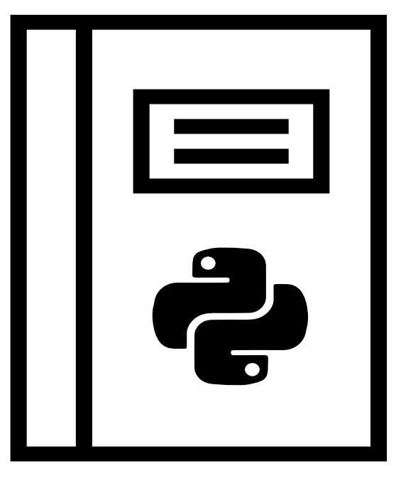

# My PyJournals

collection of python algorithm, function and theories that I learn on my road to code
I can't help it but I love to code. 

## List of python small project

* Bubbble Sort
* Heap Sort
* HangPy 
* LPTHW (Learn Python The Hard Way)
* Snake Game (classic snake game) **Still in the work**
* Unix cat command example
* Uniq word finder
* Persistence Storage example

### How to Contribute to the collection

* create a folder with an README
* use default python (preferably version 3+)
* link source of algorithm or function   
* please provide link to source of example

create for logo

-  at https://www.flaticon.com/authors/freepik
-  at https://www.flaticon.com/authors/smashicons